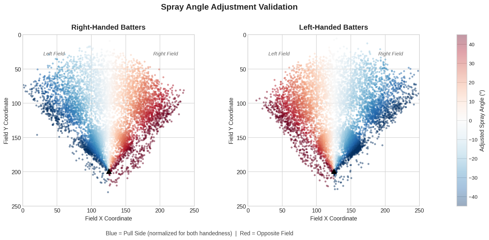
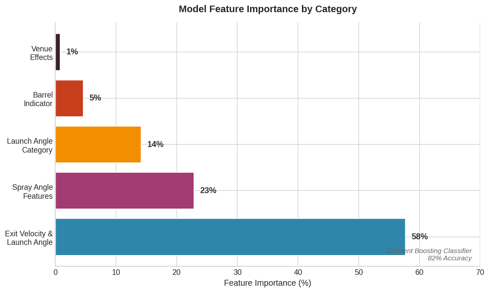
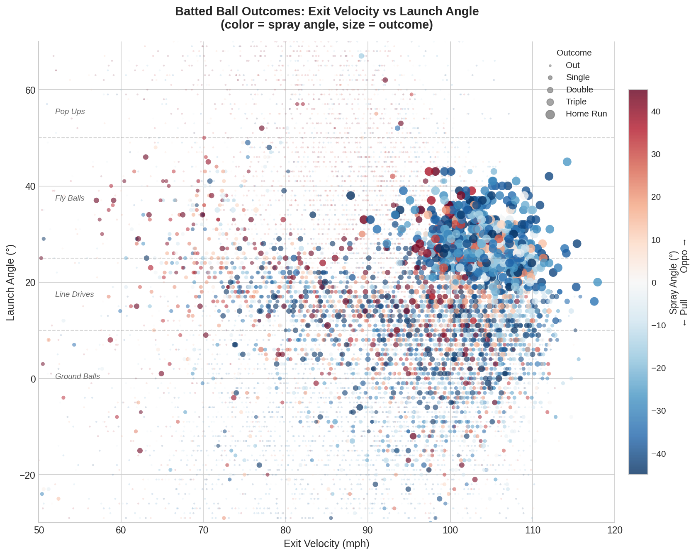

# MLB Deserve-to-Win Simulator

### https://x.com/mlb_simulator
### [@mlb-simulator.bsky.social](https://bsky.app/profile/mlb-simulator.bsky.social)

## Table of Contents
- [Description](#description)
- [Architecture](#architecture)
- [Model](#model)
- [Assumptions](#assumptions)
- [Reasons Actual vs Simulation Can Vary](#reasons-actual-vs-simulation-can-vary)
- [Future Ideas](#future-ideas)
- [2025 Additions](#2025-additions)
- [Project Structure](#project-structure)
- [Model Testing](#model-testing)
- [Outputs](#outputs)
- [2024 Research](#2024-research)
- [Contact](#contact)

## Description

This project simulates alternative outcomes of MLB games by resampling batted ball events, walks, strikeouts, steals, and pickoffs to determine who "should have won" a game. The simulator uses advanced metrics including launch angle, exit velocity, spray angle, and ballpark-specific factors to provide a more nuanced analysis of team performance and game outcomes.

This account was inspired by @MoneyPuckdotcom. The model and account are derived from data gathered from MLB Stats API.

Feel free to submit a pull request with modifications/improvements!

## Architecture

This project uses a **two-repository structure** for security:

| Repository | Visibility | Purpose |
|------------|------------|---------|
| [baseball_game_simulator](https://github.com/dgrifka/baseball_game_simulator) | Public | Core simulation engine, model, visualizations |
| baseball_simulator_model | Private | Orchestration, social media posting, credentials, GitHub Actions |

The private repo imports functions from this public repo and handles posting to Twitter/Bluesky. This keeps API credentials secure while allowing the core simulation logic to be open source.

## Model

The batted ball outcome model is a **Gradient Boosting Classifier** trained on 250K+ Statcast batted ball events from 2024-2025 seasons.

**Performance:**
- Accuracy: ~82%
- Correctly predicts outcome probabilities for simulation resampling

**Features:**
| Feature | Description |
|---------|-------------|
| `hitData_launchSpeed` | Exit velocity (mph) |
| `hitData_launchAngle` | Launch angle (degrees) |
| `distance_proxy` | Physics-based distance estimate |
| `spray_angle_adj` | Spray angle adjusted for batter handedness |
| `spray_angle_abs` | Absolute spray deviation from center |
| `is_barrel` | Optimal HR zone (95+ mph, 25-35°) |
| `is_pulled` | Ball hit to pull side |
| `is_opposite` | Ball hit to opposite field |
| `pulled_hard` | Pull side + hard contact interaction |
| `spray_ev_interaction` | Spray angle × exit velocity |
| `launch_angle_category` | Ground ball, line drive, fly ball, popup |
| `spray_direction` | Pull, center, or opposite field |
| `venue_id` | Stadium effects |

**Feature Importance:**
- Core (EV, LA, distance): ~58%
- Spray angle features: ~23%
- Launch angle category: ~14%
- Barrel indicator: ~5%
- Venue effects: <1%

For more details, see `Model/Base_Model.ipynb` and `Model/model_metadata.json`.

## Future Ideas

- Layer the expected outcome model by predicting outcomes conditional on other outcome probabilities
- Add sprint speed or stolen bases per PA to account for player speed
- Incorporate double plays into the simulations, depending on ground ball probabilities
- Incorporate prior run distribution into likelihood of the simulations

## Assumptions

- The number of strikeouts and walks/HBP remain the same in each simulation
- The simulation can have fewer/more innings than the real game, since the outcomes will be distributed differently

## Reasons Actual vs Simulation Can Vary

- **Lineup sequencing**: This simulation assigns outcomes randomly throughout the lineup, so different outcomes can be assigned to each player. A team can outperform the simulation if the roster is constructed better than the simulation assumes.
- **Defense**: This model uses launch angle, exit velocity, and spray angle to predict outcomes, so a great defensive play in the game can be a hit in the simulation.
- **9th inning effects**: If the away team put the ball in play in the 9th inning while the home team did not, the away team could be favored more in the simulation.
- **Errors**: Fielding errors are not accounted for, so a team can outperform or underperform in the simulation depending on errors.

## 2025 Additions

- **Spray angle model**: Added batter handedness-adjusted spray angle as a feature, improving accuracy from 77% to 82%
- **Feature engineering module**: Centralized spray angle and feature calculations in `Model/feature_engineering.py`
- **venue_id**: Switched from venue_name to venue_id for stability across seasons
- **Stadium mapping**: Games played at George M. Steinbrenner Field (Rays 2025 temporary home) mapped to Yankee Stadium
- Improved code docstrings and documentation
- Added steals and pickoffs to simulations
- Cleaner and improved visuals
- New `best_batted_balls.py` module for analyzing lucky/unlucky outcomes across multiple games

## Project Structure
```
baseball_game_simulator/
├── .gitignore
├── README.md
├── main.ipynb                    # Colab file to run and save visualizations
│
├── Documentation/
│   ├── readme_image_generator.ipynb  # Generate README images
│   └── Images/                   # README visualization images
│
├── Model/
│   ├── Base_Model.ipynb          # Model training notebook
│   ├── batted_ball_model.pkl     # Trained model pipeline
│   ├── feature_engineering.py    # Spray angle & feature calculations
│   ├── model_metadata.json       # Model documentation
│   └── data_loader.py            # Parquet data loading utilities
│
├── Simulator/
│   ├── best_batted_balls.py      # Analyzes lucky/unlucky outcomes
│   ├── constants.py              # Configuration and venue mappings
│   ├── game_simulator.py         # Core simulation engine
│   ├── get_game_information.py   # MLB Stats API data retrieval
│   ├── team_mapping.py           # Team name format mappings
│   ├── utils.py                  # Helper functions
│   └── visualizations.py         # Plotting functions
│
├── Data/
│   ├── batted_balls/             # Yearly parquet files
│   ├── games/                    # Games parquet file
│   ├── teams/                    # Teams parquet file
│   └── contour_data.csv          # EV/LA visualization data
│
└── Research/
    └── 2024_Season_WP_Model.ipynb # Bayesian hierarchical model research
```

## Model Testing

This section demonstrates the model's key features and outputs.

> 📓 **How these images were created:** [Documentation/readme_image_generator.ipynb](Documentation/readme_image_generator.ipynb)

### Spray Angle Adjustment Validation

The model adjusts spray angle based on batter handedness so that "pull side" is consistently represented for both right-handed and left-handed batters. Blue indicates pull side, red indicates opposite field.



### Feature Importance

Exit velocity and launch angle remain the most important features, but spray angle features contribute ~23% of the model's predictive power.



### Exit Velocity vs Launch Angle with Spray Angle

The classic "sweet spot" visualization showing how exit velocity and launch angle combine to determine outcomes. Color indicates spray angle (blue = pull, red = oppo), marker size indicates outcome quality.



## Outputs

### Spray Chart

Stadium-specific spray charts showing batted ball locations with expected outcome indicators.


### Run Distribution


### Estimated Bases Table


## 2024 Research


## Contact

Derek Grifka - https://dgrifka.github.io/
