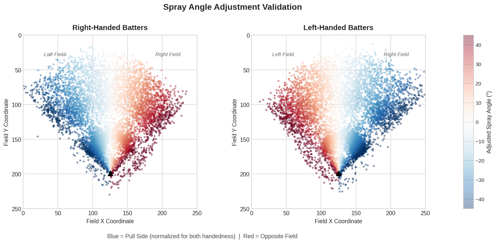
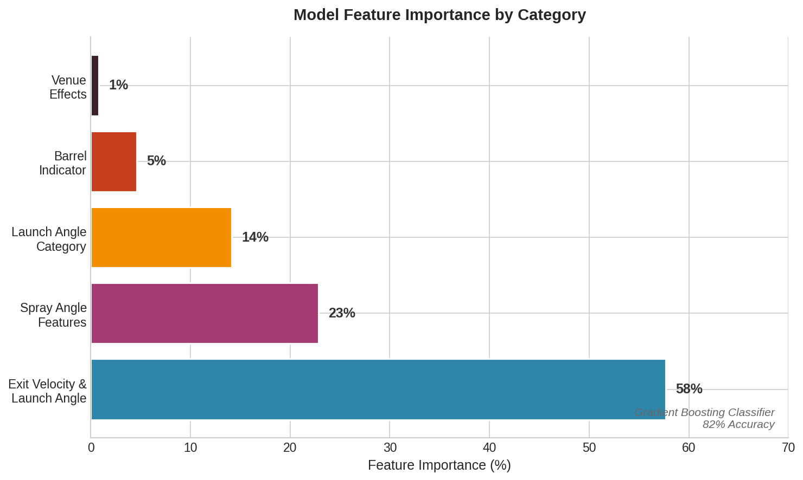
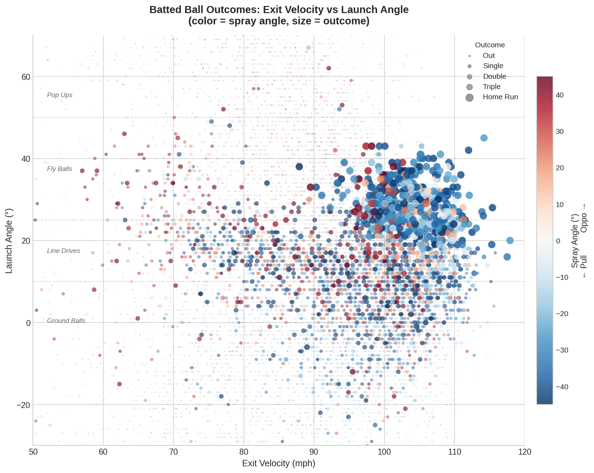

# MLB Deserve-to-Win Simulator

### https://x.com/mlb_simulator
### [@mlb-simulator.bsky.social](https://bsky.app/profile/mlb-simulator.bsky.social)

## Table of Contents
- [Description](#description)
- [Architecture](#architecture)
- [Installation](#installation)
- [Model](#model)
- [Assumptions](#assumptions)
- [Reasons Actual vs Simulation Can Vary](#reasons-actual-vs-simulation-can-vary)
- [Future Ideas](#future-ideas)
- [2026 Additions](#2026-additions)
- [2025 Additions](#2025-additions)
- [Project Structure](#project-structure)
- [Model Testing](#model-testing)
- [Outputs](#outputs)
- [Research](#research)
- [Contact](#contact)

## Description

This project simulates alternative outcomes of MLB games by resampling batted ball events, walks, strikeouts, steals, and pickoffs to determine who "should have won" a game. The simulator uses advanced metrics including launch angle, exit velocity, spray angle, and ballpark-specific factors to provide a more nuanced analysis of team performance and game outcomes.

This account was inspired by @MoneyPuckdotcom. The model and account are derived from data gathered from MLB Stats API.

Feel free to submit a pull request with modifications/improvements!

## Architecture

This project uses a **two-repository structure** for security:

| Repository | Visibility | Purpose |
|------------|------------|---------|
| [baseball_game_simulator](https://github.com/dgrifka/baseball_game_simulator) | Public | Core simulation engine, model, visualizations |
| simulator_private | Private | Orchestration, social media posting, credentials, GitHub Actions |

The private repo imports functions from this public repo and handles posting to Twitter/Bluesky. This keeps API credentials secure while allowing the core simulation logic to be open source.

## Installation

```bash
git clone https://github.com/dgrifka/baseball_game_simulator.git
cd baseball_game_simulator
python -m venv .venv && source .venv/bin/activate
pip install -r requirements.txt
```

Note: `scikit-learn` is pinned in `requirements.txt` because
`Model/batted_ball_model.pkl` is a pickled sklearn pipeline — unpickling
across sklearn versions is not guaranteed.

## Model

The batted ball outcome model is a **calibrated Gradient Boosting Classifier**
(`CalibratedClassifierCV(GradientBoostingClassifier)`, sigmoid calibration,
season-forward train/calibration split) trained on ~300K Statcast batted ball
events from the 2024-2026 seasons. It predicts a 5-class probability vector
[out, single, double, triple, home run] for each batted ball, which the
simulator resamples from.

**Performance** (held-out test set, see `Model/model_metadata.json`):
- Accuracy: 0.825
- Log loss: 0.447

**Features (21 = 19 numeric + 2 categorical, feature set "F3"):**
| Group | Features |
|-------|----------|
| Contact quality | `hitData_launchSpeed`, `hitData_launchAngle`, `launch_speed_squared`, `is_barrel`, `launch_angle_category` |
| Distance | `distance_proxy`, `hr_distance_proxy` |
| Spray | `spray_angle_adj` (handedness-adjusted; negative = pull side), `spray_angle_abs`, `spray_direction`, `is_pulled`, `is_opposite` |
| Interactions | `pulled_hard`, `oppo_hard`, `spray_ev_interaction`, `pulled_ground_ball`, `oppo_line_drive` |
| Park geometry | `altitude_ft`, `wall_distance_ft`, `carry_ft`, `over_fence_margin` |

The park-geometry features (computed from each stadium's wall polygon in
`Model/data/mlb_park_walls.csv` plus altitude in `Model/data/park_altitudes.csv`)
**replaced the old `venue_id` categorical** in 2026: instead of learning a
per-stadium fudge factor, the model sees the physics-relevant quantities —
how far the wall is along the ball's spray line, and how much carry the air
gives it. `carry_ft` is now among the most important features.

The simulator additionally applies a small **HR tail correction** at extreme
exit velocities (100+ mph) during resampling only — the exported per-ball
probabilities are always the raw calibrated model output. See the scope note
in `Simulator/game_simulator.py`.

For more details, see `Model/Spray_Angle_Model.ipynb`, `Model/train_model.py`
in the private repo (S3-based retraining), and `Model/model_metadata.json`.

## Future Ideas

- Layer the expected outcome model by predicting outcomes conditional on other outcome probabilities
- Add sprint speed or stolen bases per PA to account for player speed
- Incorporate double plays into the simulations, depending on ground ball probabilities
- Incorporate prior run distribution into likelihood of the simulations

## Assumptions

- The number of strikeouts and walks/HBP remain the same in each simulation
- The simulation can have fewer/more innings than the real game, since the outcomes will be distributed differently

## Reasons Actual vs Simulation Can Vary

- **Lineup sequencing**: This simulation assigns outcomes randomly throughout the lineup, so different outcomes can be assigned to each player. A team can outperform the simulation if the roster is constructed better than the simulation assumes.
- **Defense**: This model uses launch angle, exit velocity, and spray angle to predict outcomes, so a great defensive play in the game can be a hit in the simulation.
- **9th inning effects**: If the away team put the ball in play in the 9th inning while the home team did not, the away team could be favored more in the simulation.
- **Errors**: Fielding errors are not accounted for, so a team can outperform or underperform in the simulation depending on errors.

## 2026 Additions

- **Park-geometry features (feature set F3)**: `venue_id` replaced by `altitude_ft`, `wall_distance_ft`, `carry_ft`, and `over_fence_margin`, computed from real stadium wall polygons and altitudes (`Model/data/`). Log loss improved from 0.450 to 0.446, with better calibration at the extremes.
- **Sigmoid calibration + season-forward split**: the classifier is wrapped in `CalibratedClassifierCV(method="sigmoid")`, calibrated on a season held forward from training.
- **HR tail correction (simulation only)**: a small bump to home-run probability at 100+ mph exit velocities during resampling; exported per-ball probabilities stay raw by design.
- **Per-inning simulation primitives**: `outcomes_by_inning` / `simulator_by_inning` preserve inning structure (including steals/pickoffs) for the per-inning deserved-run-differential charts.
- **Alternate/minor-league venue support**: wall geometry and altitude for tracked non-MLB parks (e.g. Sutter Health Park, Las Vegas Ballpark), plus a generalized polygon generator.

## 2025 Additions

- **Spray angle model**: Added batter handedness-adjusted spray angle as a feature, improving accuracy from 77% to 82%
- **Feature engineering module**: Centralized spray angle and feature calculations in `Model/feature_engineering.py`
- **Improved code docstrings and documentation**
- **Cleaner and improved visuals**

## Project Structure
```
baseball_game_simulator/
├── .gitignore
├── README.md
├── requirements.txt
│
├── Documentation/
│   ├── readme_image_generator.ipynb  # Generate README images
│   └── Images/                   # README visualization images
│
├── Model/
│   ├── Spray_Angle_Model.ipynb   # Model training/EDA notebook
│   ├── batted_ball_model.pkl     # Trained model pipeline (sklearn)
│   ├── feature_engineering.py    # Spray angle, geometry & feature calculations
│   ├── model_metadata.json       # Model documentation (features, metrics)
│   ├── data_loader.py            # Parquet data loading utilities
│   └── data/
│       ├── mlb_park_walls.csv    # Stadium wall polygons (park-geometry features)
│       └── park_altitudes.csv    # Stadium altitudes
│
├── Simulator/
│   ├── best_batted_balls.py      # Analyzes lucky/unlucky outcomes (retired)
│   ├── constants.py              # Configuration and venue mappings
│   ├── game_simulator.py         # Core simulation engine (incl. per-inning sim)
│   ├── get_game_information.py   # MLB Stats API data retrieval
│   ├── style.py                  # Shared chart styling
│   ├── team_mapping.py           # Team name format mappings
│   ├── utils.py                  # Helper functions
│   ├── visualizations.py         # Plotting functions
│   └── assets/                   # Watermark/logo assets
│
├── Data/
│   ├── batted_balls/             # Yearly parquet files
│   ├── games/                    # Games parquet file
│   ├── teams/                    # Teams parquet file
│   ├── contour_data.csv          # EV/LA visualization data
│   └── fences.csv                # Raw fence-dimension source data
│
└── Research/
    ├── 2024_Season_WP_Model.ipynb # Bayesian hierarchical model research
    └── venue_effects_eda.ipynb    # Venue-effects EDA (led to F3 geometry features)
```

## Model Testing

This section demonstrates the model's key features and outputs.

> 📓 **How these images were created:** [Documentation/readme_image_generator.ipynb](Documentation/readme_image_generator.ipynb)

### Spray Angle Adjustment Validation

The model adjusts spray angle based on batter handedness so that "pull side" is consistently represented for both right-handed and left-handed batters. Blue indicates pull side, red indicates opposite field.



### Feature Importance

Exit velocity, launch angle, and distance remain central, and since the F3
feature set the park-geometry `carry_ft` feature ranks among the most
important. (Chart below predates the geometry features; see
`Model/model_metadata.json` for the current feature list.)



### Exit Velocity vs Launch Angle with Spray Angle

The classic "sweet spot" visualization showing how exit velocity and launch angle combine to determine outcomes. Color indicates spray angle (blue = pull, red = oppo), marker size indicates outcome quality.



## Outputs

### Spray Chart

Stadium-specific spray charts showing batted ball locations with expected outcome indicators.


### Run Distribution


### Estimated Bases Table


### Player Contributions


## Research

- [Who Deserved to Win: Building an MLB Game Outcome Simulator](https://medium.com/@dmgrifka_64770/who-deserved-to-win-building-an-mlb-game-outcome-simulator-b4a8d4bca2a9)
  
- [Applying Bayesian Hierarchical Methods to MLB Season Win Probabilities with PyStan](https://medium.com/@dmgrifka_64770/applying-bayesian-hierarchical-methods-to-mlb-season-win-probabilties-with-pystan-468572abb932)

## Contact

Derek Grifka - https://dgrifka.github.io/
